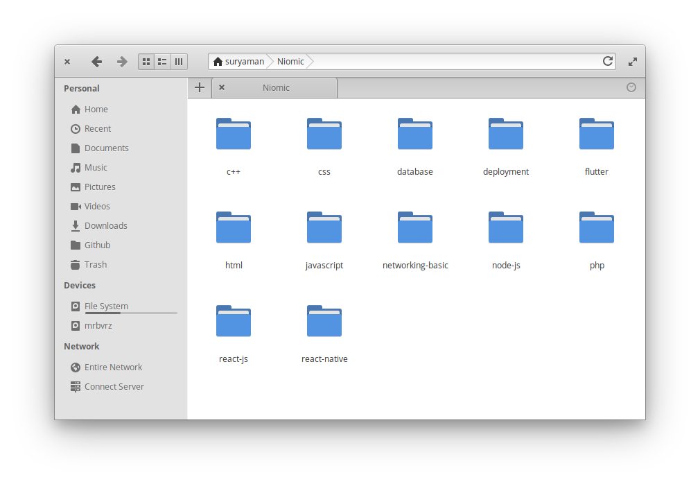

# Niomic

## Tugas Niomic
ini adalah list dari tugas [Niomic](https://niomic.com/) yang telah saya selesaikan.

### Tugas HTML
- [Tugas 1 HTML](https://github.com/hasansuryaman/tugas_1_html) - Meta chartset, element title, teta author, keyword, description, meta refresh, link icon favicon.
- [Tugas 2 HTML](https://github.com/hasansuryaman/tugas_2_html) - Icon favicon, penggunaan comment.
- [Tugas 3 HTML](https://github.com/hasansuryaman/tugas_3_html)
- [Tugas 4 HTML](https://github.com/hasansuryaman/tugas_4_html)
- [Tugas 5 HTML](https://github.com/hasansuryaman/tugas_5_html)
- [Tugas 6 HTML](https://github.com/hasansuryaman/tugas_6_html)
- [Tugas 7 HTML](https://github.com/hasansuryaman/tugas_7_html)
- [Tugas 8 HTML](https://github.com/hasansuryaman/tugas_8_html)
- [Tugas 9 HTML](https://github.com/hasansuryaman/tugas_9_html)
- [Tugas 10 HTML](https://github.com/hasansuryaman/tugas_10_html)
- [Tugas 11 HTML](https://github.com/hasansuryaman/tugas_11_html)
- [Tugas 12 HTML](https://github.com/hasansuryaman/tugas_12_html)
- [Tugas 13 HTML](https://github.com/hasansuryaman/tugas_13_html)
- [Tugas 14 HTML](https://github.com/hasansuryaman/tugas_14_html)
- [Tugas 15 HTML](https://github.com/hasansuryaman/tugas_15_html)
- [Tugas 16 HTML](https://github.com/hasansuryaman/tugas_16_html)
- [Tugas 17 HTML](https://github.com/hasansuryaman/tugas_17_html)
- [Tugas 18 HTML](https://github.com/hasansuryaman/tugas_18_html)
- [Tugas 19 HTML](https://github.com/hasansuryaman/tugas_19_html)
- [Tugas 20 HTML](https://github.com/hasansuryaman/tugas_20_html)
- [Tugas 21 HTML](https://github.com/hasansuryaman/tugas_21_html)
- [Tugas 22 HTML](https://github.com/hasansuryaman/tugas_22_html)
- [Tugas 23 HTML](https://github.com/hasansuryaman/tugas_23_html)
- [Tugas 24 HTML](https://github.com/hasansuryaman/tugas_24_html)
- [Tugas 25 HTML](https://github.com/hasansuryaman/tugas_25_html)
- [Tugas Akhir HTML](https://github.com/hasansuryaman/tugas_akhir_html)

### Tugas CSS
- [Tugas 1 CSS](https://github.com/hasansuryaman/tugas_1_css)
- [Tugas 2 CSS](https://github.com/hasansuryaman/tugas_2_css)
- [Tugas 3 CSS](https://github.com/hasansuryaman/tugas_3_css)
- [Tugas 4 CSS](https://github.com/hasansuryaman/tugas_4_css)
- [Tugas 5 CSS](https://github.com/hasansuryaman/tugas_5_css)
- [Tugas 6 CSS](https://github.com/hasansuryaman/tugas_6_css)
- [Tugas 7 CSS](https://github.com/hasansuryaman/tugas_7_css)
- [Tugas 8 CSS](https://github.com/hasansuryaman/tugas_8_css)
- [Tugas 9 CSS](https://github.com/hasansuryaman/tugas_9_css)
- [Tugas 10 CSS](https://github.com/hasansuryaman/tugas_10_css)
- [Tugas 11 CSS](https://github.com/hasansuryaman/tugas_11_css)
- [Tugas 12 CSS](https://github.com/hasansuryaman/tugas_12_css)
- [Tugas 13 CSS](https://github.com/hasansuryaman/tugas_13_css)
- [Tugas 14 CSS](https://github.com/hasansuryaman/tugas_14_css)
- [Tugas 15 CSS](https://github.com/hasansuryaman/tugas_15_css)
- [Tugas 16 CSS](https://github.com/hasansuryaman/tugas_16_css)
- [Tugas 17 CSS](https://github.com/hasansuryaman/tugas_17_css)
- [Tugas 18 CSS](https://github.com/hasansuryaman/tugas_18_css)
- [Tugas 19 CSS](https://github.com/hasansuryaman/tugas_19_css)
- [Tugas 20 CSS](https://github.com/hasansuryaman/tugas_20_css)
- [Tugas 21 CSS](https://github.com/hasansuryaman/tugas_21_css)
- [Tugas 22 CSS](https://github.com/hasansuryaman/tugas_22_css)
- [Tugas 23 CSS](https://github.com/hasansuryaman/tugas_23_css)
- [Tugas 24 CSS](https://github.com/hasansuryaman/tugas_24_css)
- [Tugas 25 CSS](https://github.com/hasansuryaman/tugas_25_css)
- [Tugas 26 CSS](https://github.com/hasansuryaman/tugas_26_css)
- [Tugas 27 CSS](https://github.com/hasansuryaman/tugas_27_css)
- [Tugas 28 CSS](https://github.com/hasansuryaman/tugas_28_css)
- [Tugas 29 CSS](https://github.com/hasansuryaman/tugas_29_css)
- [Tugas 30 CSS](https://github.com/hasansuryaman/tugas_30_css)
- [Tugas Akhir CSS](https://github.com/hasansuryaman/tugas_akhir_css)

### Tugas Javascript
- [Tugas 1 Javascript](https://github.com/hasansuryaman/tugas_1_javascript)
- [Tugas 2 Javascript](https://github.com/hasansuryaman/tugas_2_javascript)
- [Tugas 3 Javascript](https://github.com/hasansuryaman/tugas_3_javascript)
- [Tugas 4 Javascript](https://github.com/hasansuryaman/tugas_4_javascript)
- [Tugas 5 Javascript](https://github.com/hasansuryaman/tugas_5_javascript)
- [Tugas 6 Javascript](https://github.com/hasansuryaman/tugas_6_javascript)
- [Tugas 7 Javascript](https://github.com/hasansuryaman/tugas_7_javascript)
- [Tugas 8 Javascript](https://github.com/hasansuryaman/tugas_8_javascript)
- [Tugas 9 Javascript](https://github.com/hasansuryaman/tugas_9_javascript)
- [Tugas 10 Javascript](https://github.com/hasansuryaman/tugas_10_javascript)
- [Tugas 11 Javascript](https://github.com/hasansuryaman/tugas_11_javascript)
- [Tugas 12 Javascript](https://github.com/hasansuryaman/tugas_12_javascript)
- [Tugas 13 Javascript](https://github.com/hasansuryaman/tugas_13_javascript)
- [Tugas 14 Javascript](https://github.com/hasansuryaman/tugas_14_javascript)
- [Tugas 15 Javascript](https://github.com/hasansuryaman/tugas_15_javascript)
- [Tugas 16 Javascript](https://github.com/hasansuryaman/tugas_16_javascript)
- [Tugas 17 Javascript](https://github.com/hasansuryaman/tugas_17_javascript)
- [Tugas 18 Javascript](https://github.com/hasansuryaman/tugas_18_javascript)
- [Tugas 19 Javascript](https://github.com/hasansuryaman/tugas_19_javascript)
- [Tugas 20 Javascript](https://github.com/hasansuryaman/tugas_20_javascript)
- [Tugas 21 Javascript](https://github.com/hasansuryaman/tugas_21_javascript)
- [Tugas 22 Javascript](https://github.com/hasansuryaman/tugas_22_javascript)
- [Tugas 23 Javascript](https://github.com/hasansuryaman/tugas_23_javascript)
- [Tugas 24 Javascript](https://github.com/hasansuryaman/tugas_24_javascript)
- [Tugas 25 Javascript](https://github.com/hasansuryaman/tugas_25_javascript)
- [Tugas 26 Javascript](https://github.com/hasansuryaman/tugas_26_javascript)
- [Tugas 27 Javascript](https://github.com/hasansuryaman/tugas_27_javascript)
- [Tugas 28 Javascript](https://github.com/hasansuryaman/tugas_28_javascript)
- [Tugas 29 Javascript](https://github.com/hasansuryaman/tugas_29_javascript)
- [Tugas 30 Javascript](https://github.com/hasansuryaman/tugas_39_javascript)

### Tugas React JS
- [Tugas 1 React JS](https://github.com/hasansuryaman/tugas_1_reactjs)
- [Tugas 2 React JS](https://github.com/hasansuryaman/tugas_2_reactjs)
- [Tugas 3 React JS](https://github.com/hasansuryaman/tugas_3_reactjs)
- [Tugas 4 React JS](https://github.com/hasansuryaman/tugas_4_reactjs)
- [Tugas 5 React JS](https://github.com/hasansuryaman/tugas_5_reactjs)
- [Tugas 6 React JS](https://github.com/hasansuryaman/tugas_6_reactjs)
- [Tugas 7 React JS](https://github.com/hasansuryaman/tugas_7_reactjs)
- [Tugas 8 React JS](https://github.com/hasansuryaman/tugas_8_reactjs)
- [Tugas 9 React JS](https://github.com/hasansuryaman/tugas_9_reactjs)
- [Tugas 10 React JS](https://github.com/hasansuryaman/tugas_10_reactjs)
- [Tugas 11 React JS](https://github.com/hasansuryaman/tugas_11_reactjs)
- [Tugas 12 React JS](https://github.com/hasansuryaman/tugas_12_reactjs)
- [Tugas 13 React JS](https://github.com/hasansuryaman/tugas_13_reactjs)
- [Tugas 14 React JS](https://github.com/hasansuryaman/tugas_14_reactjs)
- [Tugas 15 React JS](https://github.com/hasansuryaman/tugas_15_reactjs)
- [Tugas 16 React JS](https://github.com/hasansuryaman/tugas_16_reactjs)
- [Tugas 17 React JS](https://github.com/hasansuryaman/tugas_17_reactjs)
- [Tugas 18 React JS](https://github.com/hasansuryaman/tugas_18_reactjs)
- [Tugas 19 React JS](https://github.com/hasansuryaman/tugas_19_reactjs)

### Tugas Database
- [Tugas 1 Database](https://github.com/hasansuryaman/tugas_1_database)
- [Tugas 2 Database](https://github.com/hasansuryaman/tugas_2_database)
- [Tugas 3 Database](https://github.com/hasansuryaman/tugas_3_database)
- [Tugas 4 Database](https://github.com/hasansuryaman/tugas_4_database)
- [Tugas 5 Database](https://github.com/hasansuryaman/tugas_5_database)
- [Tugas 6 Database](https://github.com/hasansuryaman/tugas_6_database)
- [Tugas 7 Database](https://github.com/hasansuryaman/tugas_7_database)
- [Tugas 8 Database](https://github.com/hasansuryaman/tugas_8_database)
- [Tugas 9 Database](https://github.com/hasansuryaman/tugas_9_database)
- [Tugas 10 Database](https://github.com/hasansuryaman/tugas_10_database)
- [Tugas 11 Database](https://github.com/hasansuryaman/tugas_11_database)
- [Tugas 12 Database](https://github.com/hasansuryaman/tugas_12_database)
- [Tugas 13 Database](https://github.com/hasansuryaman/tugas_13_database)
- [Tugas 14 Database](https://github.com/hasansuryaman/tugas_14_database)
- [Tugas 15 Database](https://github.com/hasansuryaman/tugas_15_database)
- [Tugas 16 Database](https://github.com/hasansuryaman/tugas_16_database)

### Tugas Node JS
- [Tugas 1 Node JS](https://github.com/hasansuryaman/tugas_1_nodejs)
- [Tugas 2 Node JS](https://github.com/hasansuryaman/tugas_2_nodejs)
- [Tugas 3 Node JS](https://github.com/hasansuryaman/tugas_3_nodejs)
- [Tugas 4 Node JS](https://github.com/hasansuryaman/tugas_4_nodejs)
- [Tugas 5 Node JS](https://github.com/hasansuryaman/tugas_akhir_nodejs)

### Tugas Deployment
- [Tugas 1 Deployment](https://github.com/hasansuryaman/tugas_1_deployment)

### Tugas React Native
- [Tugas 1 React Native](https://github.com/hasansuryaman/tugas_1_reactnative)
- [Tugas 2 React Native](https://github.com/hasansuryaman/tugas_2_reactnative)
- [Tugas 3 React Native](https://github.com/hasansuryaman/tugas_3_reactnative)
- [Tugas 4 React Native](https://github.com/hasansuryaman/tugas_4_reactnative)

### Tugas PHP
- [Tugas 1 PHP](https://github.com/hasansuryaman/tugas_1_php)
- [Tugas 2 PHP](https://github.com/hasansuryaman/tugas_2_php)
- [Tugas 3 PHP](https://github.com/hasansuryaman/tugas_3_php)
- [Tugas 4 PHP](https://github.com/hasansuryaman/tugas_4_php)
- [Tugas 5 PHP](https://github.com/hasansuryaman/tugas_5_php)
- [Tugas 6 PHP](https://github.com/hasansuryaman/tugas_6_php)
- [Tugas 7 PHP](https://github.com/hasansuryaman/tugas_7_php)
- [Tugas 8 PHP](https://github.com/hasansuryaman/tugas_8_php)
- [Tugas 9 PHP](https://github.com/hasansuryaman/tugas_9_php)
- [Tugas 10 PHP](https://github.com/hasansuryaman/tugas_10_php)
- [Tugas 11 PHP](https://github.com/hasansuryaman/tugas_11_php)
- [Tugas Akhir PHP](https://github.com/hasansuryaman/tugas_akhir_php)

### Tugas Networking Basic
- [Tugas 1 Networking Basic](https://github.com/hasansuryaman/tugas_1_networking_basic)
- [Tugas 2 Networking Basic](https://github.com/hasansuryaman/tugas_2_networking_basic)
- [Tugas 3 Networking Basic](https://github.com/hasansuryaman/tugas_3_networking_basic)
- [Tugas 4 Networking Basic](https://github.com/hasansuryaman/tugas_4_networking_basic)
- [Tugas 5 Networking Basic](https://github.com/hasansuryaman/tugas_5_networking_basic)
- [Tugas 6 Networking Basic](https://github.com/hasansuryaman/tugas_6_networking_basic)
- [Tugas 7 Networking Basic](https://github.com/hasansuryaman/tugas_7_networking_basic)
- [Tugas 8 Networking Basic](https://github.com/hasansuryaman/tugas_8_networking_basic)
- [Tugas 9 Networking Basic](https://github.com/hasansuryaman/tugas_9_networking_basic)
- [Tugas 10 Networking Basic](https://github.com/hasansuryaman/tugas_10_networking_basic)
- [Tugas 11 Networking Basic](https://github.com/hasansuryaman/tugas_11_networking_basic)
- [Tugas 12 Networking Basic](https://github.com/hasansuryaman/tugas_12_networking_basic)

### Tugas Flutter - Beautiful Native Apps
- [Tugas 1 flutter](https://github.com/hasansuryaman/tugas_1_flutter) - Membuat Program Dengan Menggunakan Widget Container, Text, Center.
- [Tugas 2 flutter](https://github.com/hasansuryaman/tugas_2_flutter) - Membuat Aplikasi Dengan Menggunakan Widget Container, Text, Center, Style, Icon, AppBar, Image.
- [Tugas 3 flutter](https://github.com/hasansuryaman/tugas_3_flutter)
- [Tugas 4 flutter](https://github.com/hasansuryaman/tugas_4_flutter)
- [Tugas 5 flutter](https://github.com/hasansuryaman/tugas_5_flutter)
- [Tugas 6 flutter](https://github.com/hasansuryaman/tugas_6_flutter)
- [Tugas 7 flutter](https://github.com/hasansuryaman/tugas_7_flutter)
- [Tugas 8 flutter](https://github.com/hasansuryaman/tugas_8_flutter)
- [Tugas 9 flutter](https://github.com/hasansuryaman/tugas_9_flutter)

### Tugas C++
- [Tugas 1 C++](https://github.com/hasansuryaman/tugas_1_cplusplus) - Menampilkan output nama (Hasan Suryaman)
- [Tugas 2 C++](https://github.com/hasansuryaman/tugas_2_cplusplus)
- [Tugas 3 C++](https://github.com/hasansuryaman/tugas_3_cplusplus)
- [Tugas 4 C++](https://github.com/hasansuryaman/tugas_4_cplusplus)
- [Tugas 5 C++](https://github.com/hasansuryaman/tugas_5_cplusplus)
- [Tugas 6 C++](https://github.com/hasansuryaman/tugas_6_cplusplus)
- [Tugas 7 C++](https://github.com/hasansuryaman/tugas_7_cplusplus)
- [Tugas 8 C++](https://github.com/hasansuryaman/tugas_8_cplusplus)
- [Tugas 9 C++](https://github.com/hasansuryaman/tugas_9_cplusplus)
- [Tugas 10 C++](https://github.com/hasansuryaman/tugas_10_cplusplus)
- [Tugas 11 C++](https://github.com/hasansuryaman/tugas_11_cplusplus)
- [Tugas 12 C++](https://github.com/hasansuryaman/tugas_12_cplusplus)
- [Tugas 13 C++](https://github.com/hasansuryaman/tugas_13_cplusplus)
- [Tugas 14 C++](https://github.com/hasansuryaman/tugas_14_cplusplus)
- [Tugas 15 C++](https://github.com/hasansuryaman/tugas_15_cplusplus)

 

***bulk backup*** semua tugas bisa didapatkan [disini](google.com)
